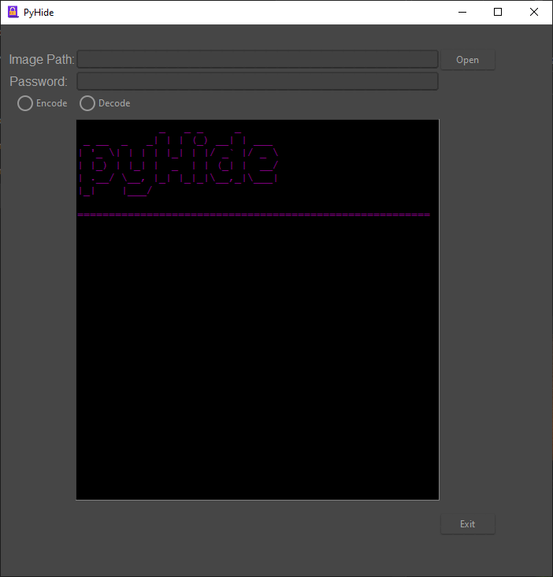
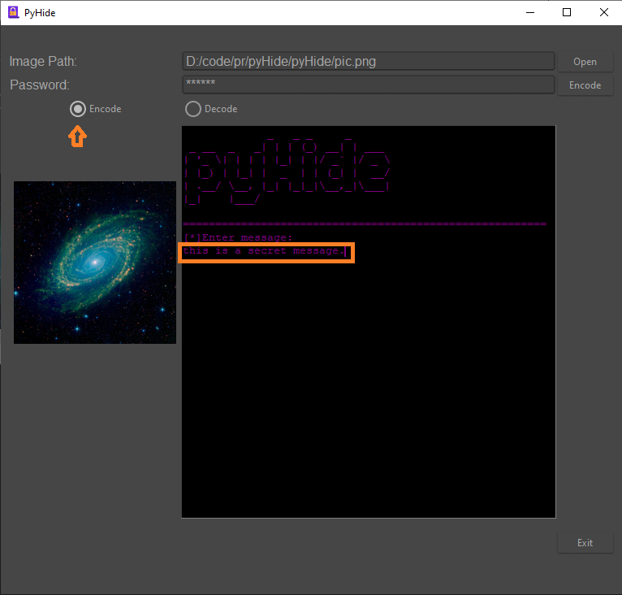
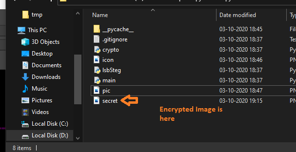
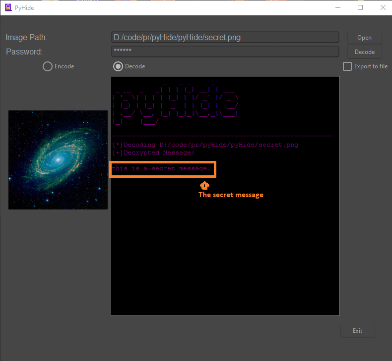

# PyHide
PyHide allows you to encrypt your data using [AES](https://en.wikipedia.org/wiki/Advanced_Encryption_Standard) encryption and then to encode it/hide it to an PNG image using lsb [steganography](https://en.wikipedia.org/wiki/Steganography) algorithm. 

### Instructions

#### Windows

If you Havent already got python, get it from here: https://www.python.org/downloads/

1. clone the repo

`git clone https://github.com/omnone/pyHide.git`

2. Install Dependencies

`pip install pyfiglet image crypto pyAesCrypt`

3. Execute main.py inside the pyHide folder

`python main.py`

#### Encoding 

- Select a image Path

- Select Encode option and Type the secret message in the command window

- Type a password to encrpyt the message

- hit encode

the encoded image is in the same folder as main.py 

#### Decoding

- Select the encoded image

- Select decode option and enter the same password used for encoding

- hit decode

