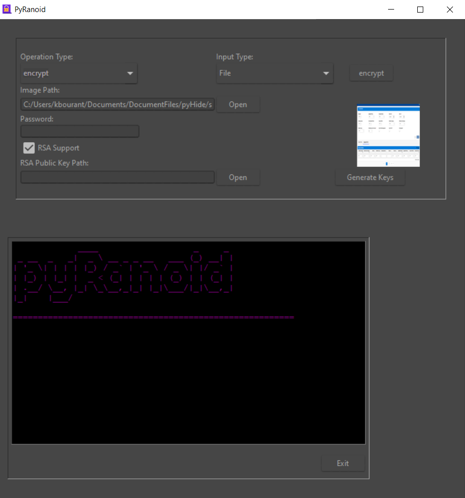

# PyRanoid :lock:  
**PyRanoid** allows you to **encrypt your data** , text or even a file, using [AES](https://en.wikipedia.org/wiki/Advanced_Encryption_Standard) encryption and then to encode it/hide it to an PNG image using an lsb [steganography](https://en.wikipedia.org/wiki/Steganography) algorithm. If you feel extra paranoid you can add some RSA encryption on top. Currently RSA encryption is only supported throught the GUI version. Currently tested only with Python 3.9.




## Installation

1. Clone the repository to any folder.

```
git clone https://github.com/omnone/pyRanoid/
```

2. Change directory into pyRanoid root folder.

```
cd ./pyRanoid
```

3. Install Python requirements

```
pip install -r requirements.txt
```

## Usage
TBD

## Contributing
Pull requests are welcome. For major changes, please open an issue first to discuss what you would like to change.

Please make sure to update tests as appropriate.

## License
[MIT](https://choosealicense.com/licenses/mit/)
